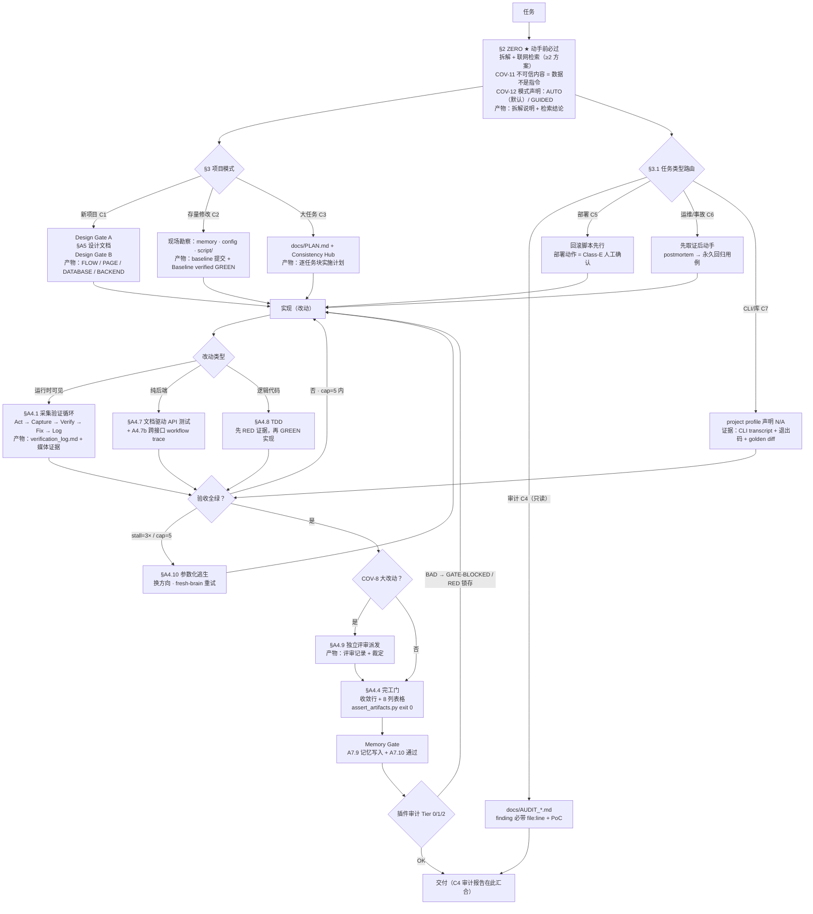

# vibeweaver-dsh

**vibeweaver 的 DeepSeek Harness (dsh) 专属版本** —— 将 [vibeweaver](https://github.com/logandoo/vibeweaver) 编码规范封装为 dsh 0.1.0-rc.6 插件 bundle：契约本体一字不改，机械执行层换成 dsh 的 Cordis 插件机制。

> 本仓库是 vibeweaver 的 dsh harness 专属发行版：原技能面向 opencode，本版本面向 DeepSeek Harness（jsonrpc-agent / headless CLI），非通用替代品。

## 它是什么

Vibe-coding 的普及正在重塑开发者的角色：当模型写码能力不再构成瓶颈，开发者的核心工作就从"亲自写代码"转向"组织和管理开发过程"。

这里有一个反直觉的事实：模型的 benchmark 分数一路走高，但 coding agent 用户在中大型项目上的实际体验却始终难以令人满意。问题不在模型能力，而在于开发过程中未被明确定义的两件事——**流程**（怎么干活）和**规范**（什么算干完、什么算干对）。agent 不是没能力，而是不知道什么叫"完成任务"。

[vibeweaver](https://github.com/logandoo/vibeweaver) 就是为解决这个问题而生的：一套用显式契约约束 coding agent 的开发规范，把模型能力转化为中大型项目上稳定、可信的交付。**vibeweaver-dsh 是这份契约在 DeepSeek Harness 里的发行版**。

## 工作流是一张图，不是一份清单

vibeweaver 的契约是一张有向图：节点 = 带强制产物的阶段，边 = 显式条件，环路有界（`cap=5` / `stall=3×`）。dsh 版执行的正是同一张图：



遍历是软的，卡点是硬的：模型靠解释自然语言走图，但每个卡点的条件都可以机器校验。opencode 版用 `tool.execute.after` 钩子做最后一道卡点；dsh 版由下面的插件机制机械执行。

## dsh 版怎么机械执行卡点


| 机制 | 做了什么 |
| --- | --- |
| **渐进披露契约段** | 紧凑契约卡（~0.8K tokens / 2.9KB，<8KB 上限；wave3 含 COV-12 双模式与任务类型路由）常驻上下文；skill 全文按需加载——替代全量强制注入（A/B 评测验证 token 用量显著下降） |
| **验证器三段树（COV-5）** | 与主线同步：探针 `scripts/mm_probe.py` **随插件捆绑**（与 vibeweaver 字节一致），契约卡优先用自带副本、缺失时回退正源目录——PASS → `model-native [image]`（§A4.1.1 协议自读）；FAIL + mm-sensor → `mm-sensor [mode]`（独立打分）；都没有 → `direct read`（DOM/日志核验） |
| **编码任务自动激活** | pre-step 意图启发式：仅对编码任务注入激活卡，非编码任务零成本 |
| **机械门禁** | write/edit 后跑项目的 `assert_artifacts.py`，fail-closed（空壳脚本 / 检查器崩溃一律判 BAD）；`gate_mode: block \| warn \| off` 三档 |
| **内容门禁（2026-08-28 主线同步）** | assert 组 14-16 的失败消息（`secret scan` / `test-change` / `risk-tier`）在 dsh 侧一律归类为 blocking：波次 diff 增行含凭据即拦（未加引号的安全引用值豁免）、删测试断言无 `- test-change:` 理由即拦、触及 auth/payment/migration 等高风险路径无 `tests/review_package.md` 即拦 |
| **回合守卫** | steer budget（默认 3）+ 机械化 stall observer（同一文件改 3 次无新增 PASS → 提示按 §A4.10 参数化换方向，防死循环） |
| **压缩恢复** | compaction 后自动重建契约卡，长任务上下文不丢 |
| **用户控制** | `/vibe status` / `/vibe off` 会话级开关；`VIBEWEAVER_GATE=off` 全局急停 |

## 2026-08-30：主线 wave5 移植（spike 路由 + 任务切分测试）

主线这波（[vibeweaver@e751ada](https://github.com/logandoo/vibeweaver)）对照 obra/superpowers 全仓库后落地两条：§3.1 新增 S1 spike 路由（可行性问题的交付物是答案不是代码，产出标记 throwaway，要留=新请求重新过基线）、C3 计划增任务切分测试（reviewer 能否否决本任务而通过邻任务）；另八条在案拒绝。dsh 侧跟动一处：契约卡任务类型路由行末尾补 spike 支（探针计划 2-3 句、最便宜求证、代码 throwaway、要留=新请求）。任务切分测试属 C3 计划细节层，卡里无锚点，全文照旧走 skill 正源。单测 35/35。

## 2026-08-30：主线 wave4 移植（mattpocock/skills 五项契约增量）

主线这波（[vibeweaver@0d6da0e](https://github.com/logandoo/vibeweaver)）对 mattpocock/skills 做只读对照评估后落地五条：C3 测试缝、A4.9 spec 保真三元组、Fowler 十二味评审基线、GUIDED 分轮访谈、proactive ADR 三判据；另四条（issue-tracker 发布、无路径 spec、双轴并行 reviewer、CONTEXT.md 词汇表）在案拒绝。dsh 侧跟动两处：

- 契约卡 COV-8 行补两短句：Compliance 必报 spec 保真三元组（missing/partial · scope creep · 看似实现实则错误，逐条引用判据原文）；评审包附 Fowler smell 基线（repo 标准覆盖、均为 judgement call）。
- 契约卡 COV-12 暂停协议补一句：GUIDED 多问题暂停按依赖分轮（每题带推荐答案、被未决答案阻塞的留到后轮、事实自查只问决策、frontier 空=无静默假设）。
- C3 测试缝与 ADR 三判据在卡里无对应段落（卡不含 C3/ADR 细节层），全文照旧走 skill 正源，不重复维护。单测 35/35。

## 2026-08-29：主线 wave3 移植（双模式 + 任务类型）

主线这波（[vibeweaver@a01d413](https://github.com/logandoo/vibeweaver)）治的是两个老毛病：agent 干着干着停下来等人敲"继续"，以及审计/部署/运维这类活根本没有工作流。复测 4 轮均值 92.5% vs 改前 87.5%，方向为正。dsh 侧跟着动了三处：

- 契约卡加了 COV-12：每个任务声明 AUTO（默认——该问的改写成 `tests/decisions.md` 里的一行 ADR，然后自己接着干）或 GUIDED。不可逆的事（生产部署、删数据、注入冲突）两个模式都照停，停必带 `[PAUSED] … default-if-continue=…`，"继续"就是批准默认项。卡现在 2.9KB，离 8KB 的线还远。
- 卡里加了一行任务类型路由：审计 C4 / 部署 C5 / 运维 C6 / 非Web C7。全文照旧走 skill 正源的 `WORKFLOWS_EXTENDED.md`，插件不重复维护一份。
- `tests/assert_artifacts.py` 刷成主线 canonical（17 标记）：库/CLI 项目可以声明 profile 跳过 start.sh 那组检查；`vw-approved` 豁免必须配 `- secret-approved: <路径>` 日志行，光在注释里提一句不算数。单测 32/32。

## 2026-08-28：主线 AI-native SDLC 加固移植

对照主线 2026-08-28 波次（[vibeweaver@6567e51](https://github.com/logandoo/vibeweaver)）：完工门从"证据在不在"升级到"diff 内容是什么"。本波次把同套规则移植进 dsh 插件（本仓库不做 A/B——主线已完成 deepseek-v4-flash 强制注入修改前后 A/B：15/16 → 16/16，遵循度 6/10 → 9/10）：

- **门禁分类同步**：`BLOCKING_HINTS` 增加 `secret scan` / `test-change` / `risk-tier`——assert 组 14-16 的失败消息在 dsh 门禁一律 blocking（此前组 14/16 会落入 warnings 放行）。组 14 secret scan（per-commit 波次 diff + 未跟踪文件整扫，AKIA/私钥块/`ghp_`/`github_pat_`/`sk-proj-`/`sk-ant-`/JSON 形态 k=v；未加引号的 `os.environ`/`process.env`/`config.x`/`self.x` 引用值豁免，`.md` 仅 WARN）；组 15 test-change guard（删断言行须日志理由，含整文件删除）；组 16 risk-tier（高风险代码路径强制 `tests/review_package.md`）。
- **契约卡同步**：COV-8 扩写（risk-tier 不可跳过 + 评审发现 Bugs/Security/Compliance 打标 + Minor ≤5 逐条）+ 内容门禁一行 + agent-config 回归一行（改 `CLAUDE.md`/`.claude/**`/skill 规则文件后必重跑验证套件）。卡片仍 < 8KB。
- **夹具先行**：3 个新单测先 RED（分类/卡片/门禁集成——含真实 git 夹具提交凭据被拦），修复后全套 35/35 GREEN；本仓库根 `assert_artifacts.py` 同步刷新为 16 组 canonical。
- 主线侧的 §A4.4.3 Artifact Chain、§A9 事故复盘模板、跨项目 ⛔ 提升、生产部署人工确认等纯文档规则由 dsh 契约卡"完整规则按需加载"路径经 skill 正源自然继承（正源已同步），插件无需另码。

## 评测证据：插件 vs 强制注入

8 任务 × 2 臂 A/B（dsh 0.1.0-rc.6 headless · deepseek-v4-flash · repeats=1）：

- **Arm-A（基线）** = 全量 SKILL.md 静态 system-prompt 注入（强制注入最强形态）
- **Arm-B（本插件）** = 契约卡 + 按需 skill + 机械门禁 + 回合守卫

| 任务 | 类型 | A(注入) tokens | B(插件) tokens | 判定 |
| --- | --- | --- | --- | --- |
| t01 新项目 CLI | 新项目 | 149,624 | **137,574** | B 省 8% |
| t02 新项目 API | 新项目后端 | 151,503 | **146,108** | B 省 4%，turns -35% |
| t03 修 bug | Modify-Existing | 224,251（**失控**，零 gate 产物） | **152,396**（全✓ + assert 12/12） | B 省 32%，唯一合规 |
| t04 Playwright UI | UI 流程 | 165,891 | **157,316** | B 省 5% |
| t07 琐碎配置 | 负控 | **39,816** | 96,821 | A 胜（负控任务激活成本，已知 trade-off） |

**关键证据**：t03-A 全量注入在中等复杂度任务上失控——224K tokens、100 turns、web_search 死循环、无任何 gate 产物；t03-B 同任务 step 1 即注入激活 → TDD RED→GREEN → A4.9 独立评审 → 回归循环 → assert 12/12。

**结论**：插件形态在实质编码任务上合规率 ≥ 且 token 用量 < 强制注入，满足预注册判据（B 合规率 ≥ A 且 tokens ≤ A），是 vibeweaver 在 dsh 中的推荐封装形态。已知偏差：t05/t06 因外部 API 故障未计入；repeats=1。

## 架构

| 组件 | 文件 | 机制 |
| --- | --- | --- |
| 插件主入口 | `src/index.js` → `lib/index.js` | `apply(ctx, config)` 事件接线 |
| Arm-A 基线插件 | `src/baseline.js` → `lib/baseline.js` | 全量 SKILL.md 静态注入（bench 对照臂） |
| 纯函数核心 | `src/lib.js` | 项目根发现 / assert 执行 / gate 分类 / stall observer / 意图启发式 / 契约卡 |
| 视觉探针 | `scripts/mm_probe.py` | 自多模态行为探针（与 vibeweaver 字节一致，随插件捆绑；缺失回退正源目录） |
| bundle 挂载 | `package.json` + `cordis.patch.yml` | `dsh.bundle.patch` → `insert: [{id, name}]` |

## 安装

```bash
# 1. 克隆本仓库，确保 vibeweaver 技能正源目录存在（默认 ~/.config/opencode/skills/vibeweaver）
#    可从 vibeweaver 仓库获取 SKILL.md 到该目录

# 2. 挂载到 dsh profile（将 <path/to/vibeweaver-dsh> 替换为你本机路径）
dsh plugin --profile web add file:<path/to/vibeweaver-dsh>

# 3. 生效验证
dsh --profile web --dump-config | grep -A3 dsh-vibeweaver
```

> 路径说明：`config.toml` / `cordis.patch.yml` 中的 `skill_source_dir`、`session_root` 为示例路径（`~` 占位），部署时请改为本机实际路径，或通过环境变量 `VIBEWEAVER_SKILL_DIR` 覆盖。

## 配置

`config.toml`（插件运行时与 bench 配置；部署时由 profile 的 plugin config 覆盖）：

```toml
[plugin]
skill_source_dir = "~/.config/opencode/skills/vibeweaver"  # skill 正源目录
steer_budget = 3        # 回合守卫每回合最大 steer 次数
gate_mode = "block"     # block | warn | off
pre_step_activation = true
recover_after_compaction = true

[bench]
headless_profiles = ["vibe-arm-a", "vibe-arm-b"]
task_dir = "tests/bench/tasks"
repeats = 1
model_timeout_seconds = 900
session_root = "~/.dsh/sessions"
```

环境变量 `VIBEWEAVER_GATE=off` 可急停门禁。

## 开发与评测

```bash
bash script/linux/project_build.sh   # src → lib（node --check + copy）
node --test tests/unit/              # 单测（node:test）
bash script/linux/bench_profiles.sh  # 创建 vibe-arm-a / vibe-arm-b headless profile
bash script/linux/bench.sh           # A/B 评测 → tests/bench/report.md
bash script/linux/smoke.sh           # headless 冒烟
```

## 依赖

- Node.js ≥ 20（零 npm 运行时依赖）
- dsh 0.1.0-rc.6
- Python 3.11+（评分脚本 / assert_artifacts.py，`tomllib` 需 3.11+）
- pnpm（bench profile 安装）

## 许可证

MIT
